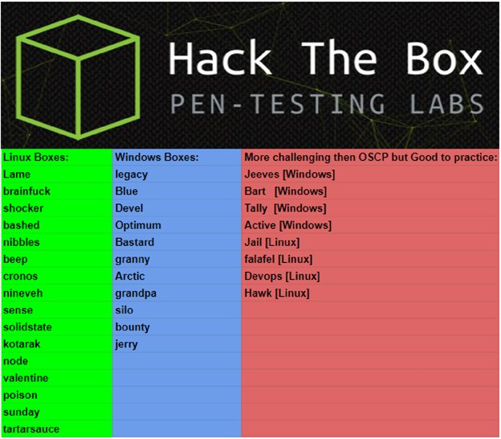

# oscp prep and notes
## find
### find files by size in currecnt directory
- ```find . -type f -size <bytes>c```
- ```find . -type f | xargs grep "<pattern>"```
- ```find / -user <user|userid>```
- ```find / -group <group|groupid>```

## xxd
### make a hexdump or do the reverse
- ```xxd <infile> <outfile>```
- ```xxd -r <infile> <outfile>```
- ```cat <hexfile> | xxd -r```


## oscp - bof practice
- [reddit - Buffer overflow practice for OSCP?](https://www.reddit.com/r/netsecstudents/comments/9ld0ps/buffer_overflow_practice_for_oscp/)
- [OSCP Course & Exam Preparation](https://411hall.github.io/OSCP-Preparation/)


## Pentest Goals

_4-7 years experiance in the at least 3 of the following:_

- Network penetration testing and manipulation of network infrastructure
- Mobile and/or web application assessments
- Email, phone, or physical social-engineering assessments
- **Shell scripting or automation of simple tasks using Perl, Python, or Ruby**
- Developing, extending, or modifying exploits, shellcode or exploit tools
- Developing applications in C#, ASP, .NET, ObjectiveC, Go, or Java (J2EE)
- Reverse engineering malware, data obfuscators, or ciphers
- Source code review for control flow and security flaws
- Strong knowledge of tools used for wireless, web application, and network security testing
- **Thorough understanding of network protocols, data on the wire, and covert channels**
- **Mastery of Unix/Linux/Mac/Windows operating systems, including bash and Powershell**

## other

- [win priv esc](https://www.udemy.com/course/windows-privilege-escalation/)
- [lin priv esc](https://www.udemy.com/course/linux-privilege-escalation/)

## resources

- [gtfobins](https://gtfobins.github.io/)
- [lolbas](https://github.com/LOLBAS-Project/LOLBAS)
- [payload all the things](https://github.com/swisskyrepo/PayloadsAllTheThings)
- [secwiki](https://github.com/SecWiki)
- [redteamcheatsheet](https://github.com/sh4d3s/RedTeamCheatsheet)
- []()
